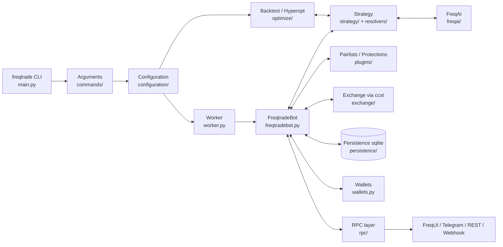
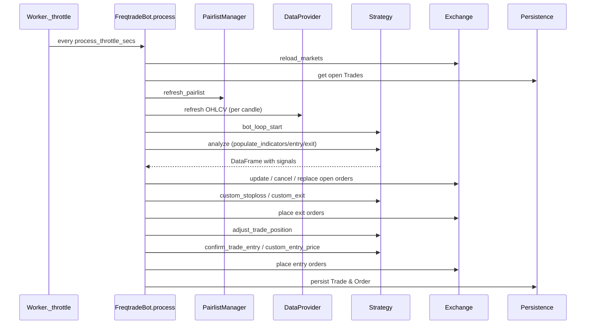
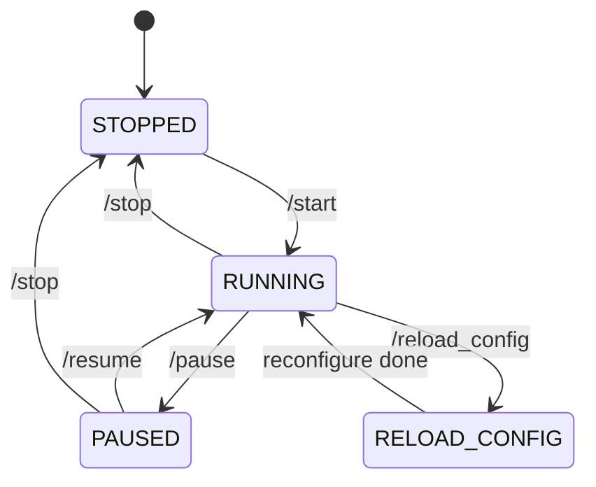

# 01. Nguyên tắc hoạt động của Freqtrade

> Tài liệu này tổng hợp triết lý, kiến trúc và vòng đời của bot, đối chiếu
> trực tiếp với mã nguồn để bạn nắm được "bot làm gì, ở đâu trong code".

---

## 1. Freqtrade là gì?

[Freqtrade](https://github.com/freqtrade/freqtrade) là một **bot giao dịch
tiền mã hoá** (crypto trading bot) mã nguồn mở, viết bằng Python ≥ 3.11. Bot
tự động hoá bốn việc cốt lõi:

1. **Giao dịch trực tiếp/giả lập** (live / dry-run trade) trên các sàn
   tập trung (CEX) như Binance, Bybit, Kraken, OKX… và sàn phi tập trung
   (DEX) Hyperliquid — qua thư viện [ccxt](https://github.com/ccxt/ccxt).
2. **Backtest** một chiến lược (strategy) trên dữ liệu lịch sử
   (OHLCV / orderbook / trades).
3. **Hyperopt** — tối ưu tham số chiến lược bằng
   [Optuna](https://optuna.org/) với các hàm loss tích hợp sẵn.
4. **FreqAI** — pipeline machine-learning thích ứng (adaptive ML) cho phép
   strategy huấn luyện lại theo thị trường ([docs/freqai.md](../freqai.md)).

Bot điều khiển được qua **CLI**, **REST API + WebUI (FreqUI)**, **Telegram**,
**Webhook**, và có thể chạy **multi-bot** theo mô hình
producer/consumer ([docs/producer-consumer.md](../producer-consumer.md)).

Phiên bản hiện tại được khai báo ở
[`freqtrade/__init__.py`](../../freqtrade/__init__.py) (`__version__`), điểm
khởi chạy là [`freqtrade/main.py`](../../freqtrade/main.py).

---

## 2. Triết lý vận hành

Freqtrade **không** là một "tín hiệu" hay "chiến lược dựng sẵn". Bot là một
**khung điều phối** (framework) thực thi nghiêm ngặt các quyết định mà
strategy của bạn đưa ra. Triết lý gồm bốn nguyên tắc lớn:

1. **Strategy quyết định tín hiệu, bot quyết định thực thi.** Strategy chỉ
   tạo cột `enter_long / exit_long / enter_short / exit_short` trên
   DataFrame. Mọi việc đặt lệnh, tính lượng (stake), kiểm soát rủi ro do
   `FreqtradeBot` xử lý — xem
   [`freqtrade/freqtradebot.py`](../../freqtrade/freqtradebot.py).
2. **Backtest và live phải dùng cùng một strategy.** Cùng một class
   `IStrategy` chạy được ở cả 2 môi trường, đảm bảo tính tái lập. Sự khác
   biệt nằm ở **tần suất gọi callback** và việc fill order là thật (live)
   hay giả lập (backtest) — chi tiết
   [`docs/bot-basics.md`](../bot-basics.md).
3. **Persistence là single source of truth.** Mọi trade và order đều ghi
   vào DB SQLite/Postgres qua SQLAlchemy
   ([`freqtrade/persistence/`](../../freqtrade/persistence/)). Bot khởi
   động lại có thể tiếp quản trade đang mở.
4. **An toàn mặc định.** `dry_run = True` mặc định; bot chỉ thực sự đặt
   lệnh khi bạn chủ động bật và cấp khoá API. Mọi tính toán lợi nhuận
   đều bao gồm phí (fee).

---

## 3. Thuật ngữ cốt lõi

Phần này dịch và mở rộng [`docs/bot-basics.md`](../bot-basics.md):

| Thuật ngữ | Tiếng Anh | Ý nghĩa |
|-----------|-----------|---------|
| Chiến lược | Strategy | Class kế thừa `IStrategy`, định nghĩa tín hiệu vào/ra |
| Trade | Trade / Position | Một vị thế đang/đã mở; lưu trong DB |
| Lệnh mở | Open Order | Lệnh đã đặt lên sàn nhưng chưa khớp đủ |
| Cặp | Pair | `base/quote` (spot, ví dụ `ETH/USDT`) hoặc `base/quote:settle` (futures, ví dụ `ETH/USDT:USDT`) |
| Khung thời gian | Timeframe | Độ dài nến: `1m`, `5m`, `1h`, `1d` … |
| Chỉ báo | Indicators | SMA, EMA, RSI… do bạn tính trong `populate_indicators()` |
| Lệnh giới hạn | Limit order | Khớp tại giá đã chỉ định hoặc tốt hơn |
| Lệnh thị trường | Market order | Khớp ngay, có thể trượt giá khi vol lớn |
| Lợi nhuận hiện tại | Current / Unrealized profit | Lợi nhuận tạm tính của trade đang mở |
| Lợi nhuận đã chốt | Realized profit | Lợi nhuận từ phần đã đóng (liên quan partial exit) |
| Tổng lợi nhuận | Total profit | Realized + unrealized |
| Stake | Stake | Số tiền (theo `stake_currency`) bot dùng cho mỗi vị thế |
| Whitelist / Blacklist | — | Cặp được phép / bị cấm giao dịch |
| Pairlist | — | Chuỗi (chain) các handler chọn cặp động (xem `plugins/pairlist`) |
| Protection | — | Cơ chế khoá pair sau sự kiện rủi ro (drawdown, stoploss liên tiếp…) |
| ROI | minimal_roi | Bảng lợi nhuận theo phút → tự exit khi đạt |
| Stoploss | — | Mức cắt lỗ; có cả trailing và custom stoploss |
| Dry-run | — | Mô phỏng giao dịch real-time, không gửi lệnh thật |
| Live | — | Đặt lệnh thật, có ràng buộc số dư & API key |
| Backtest | — | Mô phỏng trên dữ liệu lịch sử |
| Hyperopt | — | Tối ưu tham số strategy bằng Optuna |
| FreqAI | — | Lớp ML thích ứng tích hợp vào strategy |
| Producer / Consumer | — | Cơ chế nhiều bot chia sẻ tín hiệu cho nhau |

---

## 4. Kiến trúc tổng thể

### 4.1. Cây thư mục cốt lõi

```
freqtrade/
├── main.py              # Entry point (`freqtrade` CLI)
├── worker.py            # Worker.run() — vòng lặp throttling
├── freqtradebot.py      # FreqtradeBot — orchestrator chính
├── wallets.py           # Wallets — số dư & dry-run wallet
├── constants.py         # Hằng số toàn cục (PROCESS_THROTTLE_SECS,…)
├── exceptions.py        # Cây exception
├── commands/            # Tầng CLI: Arguments, start_trading, ...
├── configuration/       # Đọc/merge/normalize config + env vars
├── config_schema/       # JSON-Schema validate config
├── data/                # OHLCV, history, dataprovider, btanalysis
├── exchange/            # ccxt wrapper + exchange-specific override
├── persistence/         # SQLAlchemy: Trade, Order, PairLock, KV store
├── strategy/            # IStrategy, hyper params, helpers, validator
├── plugins/             # Pairlist & Protection plugins
├── resolvers/           # Loader động cho strategy/exchange/plugin
├── optimize/            # Backtesting + Hyperopt + analysis
├── freqai/              # Pipeline ML thích ứng
├── leverage/            # Tính liquidation price, funding fees
├── rpc/                 # Telegram, REST API (FastAPI), Webhook, WS
├── plot/                # Plotly chart helpers
├── templates/           # Sample strategy, hyperopt loss, notebook
├── system/              # asyncio_setup, gc_set_threshold, mp start
├── util/                # Datetime, FtPrecise, MeasureTime, migrations
├── enums/               # Enum: State, RunMode, ExitType, ...
├── ft_types/            # TypedDict / dataclass type hints
└── vendor/              # Mã của bên thứ ba được fork vào repo
```

Test nằm tách biệt ở [`tests/`](../../tests/), client SDK độc lập ở
[`ft_client/`](../../ft_client/), workspace người dùng ở
[`user_data/`](../../user_data/).

### 4.2. Sơ đồ kiến trúc



### 4.3. Lớp tách biệt giữa CLI và core

- [`main.py`](../../freqtrade/main.py) chỉ xử lý: bắt KeyboardInterrupt,
  dispatch sub-command (`args["func"](args)`), in lỗi, `sys.exit(code)`.
- Mỗi sub-command có một hàm `start_*` trong
  [`freqtrade/commands/`](../../freqtrade/commands/) (`start_trading`,
  `start_backtesting`, `start_hyperopt`, `start_download_data`, ...).
- `start_trading` là điểm duy nhất tạo `Worker` và gọi
  [`Worker.run()`](../../freqtrade/worker.py).

---

## 5. Vòng đời (lifecycle) của bot khi `freqtrade trade`

Từ `main()` đến vòng lặp giao dịch, các bước được mô tả khái quát ở
[`docs/bot-basics.md`](../bot-basics.md). Bên dưới là phiên bản đối chiếu
với code thật.

### 5.1. Khởi tạo

1. [`freqtrade/main.py`](../../freqtrade/main.py) `main()`:
   - `setup_logging_pre()` — log sớm để bắt lỗi config.
   - `asyncio_setup()`, `gc_set_threshold()`, `set_mp_start_method()` —
     trong [`freqtrade/system/`](../../freqtrade/system/).
   - `Arguments(sysargv).get_parsed_arg()` — parse argv qua argparse.
   - Dispatch: `args["func"](args)` → trỏ đến `start_trading` ở
     [`freqtrade/commands/trade_commands.py`](../../freqtrade/commands/trade_commands.py).
2. `start_trading(args)` tạo `Worker(args)` và gọi `worker.run()`.
3. [`Worker.__init__`](../../freqtrade/worker.py) gọi `_init(False)`:
   - Load config qua `Configuration(self._args, None).get_config()`
     ([`freqtrade/configuration/configuration.py`](../../freqtrade/configuration/configuration.py)) —
     nó đọc các file `--config` (mặc định `config.json`), merge với
     biến môi trường `FREQTRADE__*`, validate JSON-Schema.
   - Khởi `FreqtradeBot(self._config)`:
     - `ExchangeResolver.load_exchange(...)` chọn class trong
       [`freqtrade/exchange/`](../../freqtrade/exchange/) (mặc định
       `Exchange`, có override per-exchange như `binance.py`, `bybit.py`).
     - `StrategyResolver.load_strategy(self.config)` load class strategy
       theo tham số `--strategy` (qua resolver động ở
       [`freqtrade/resolvers/strategy_resolver.py`](../../freqtrade/resolvers/strategy_resolver.py)).
     - `init_db(self.config["db_url"])` — mở SQLAlchemy session.
     - Tạo `Wallets`, `RPCManager`, `PairListManager`,
       `ProtectionManager`, `DataProvider`.
4. Bot phát `READY=1` cho systemd nếu bật `internals.sd_notify`, và bước
   vào vòng lặp `Worker.run()`.

### 5.2. Vòng lặp throttling

`Worker.run()` lặp vô tận cho đến khi nhận tín hiệu thoát:

```python
def run(self) -> None:
    state = None
    while True:
        state = self._worker(old_state=state)
        if state == State.RELOAD_CONFIG:
            self._reconfigure()
```

Mỗi lần gọi `_worker()`:

- Đọc `self.freqtrade.state` (xem enum
  [`State`](../../freqtrade/enums/runmode.py)): `RUNNING`, `PAUSED`,
  `STOPPED`, `RELOAD_CONFIG`.
- Nếu state đổi thành `RUNNING`/`PAUSED`, gọi `freqtrade.startup()` (lần
  đầu): cập nhật precision, load lại open orders, migration trade nếu cần.
- `RUNNING/PAUSED`: `_throttle(_process_running, throttle_secs, timeframe,
  timeframe_offset=1)`. Nội bộ `_throttle` đo thời gian thực thi của
  `func`, ngủ phần dư cho đủ `throttle_secs` (mặc định 5s — hằng
  `PROCESS_THROTTLE_SECS` trong
  [`freqtrade/constants.py`](../../freqtrade/constants.py)) và canh tới
  cây nến mới nếu `timeframe` được truyền.
- `STOPPED`: chạy `_process_stopped` (kiểm tra trade mở, ping watchdog).

### 5.3. Một iteration của `FreqtradeBot.process()`

`_process_running` gọi `freqtrade.process()`. Trích đoạn cốt lõi từ
[`freqtrade/freqtradebot.py:257`](../../freqtrade/freqtradebot.py):

```python
def process(self) -> None:
    self.exchange.reload_markets()
    self.update_trades_without_assigned_fees()
    trades: list[Trade] = Trade.get_open_trades()
    self.active_pair_whitelist = self._refresh_active_whitelist(trades)
    self.dataprovider.refresh(
        self.pairlists.create_pair_list(self.active_pair_whitelist),
        self.strategy.gather_informative_pairs(),
    )
    strategy_safe_wrapper(self.strategy.bot_loop_start, supress_error=True)(
        current_time=datetime.now(UTC)
    )
    with self._measure_execution:
        self.strategy.analyze(self.active_pair_whitelist)
    with self._exit_lock:
        self.manage_open_orders()
    with self._exit_lock:
        trades = Trade.get_open_trades()
        self.exit_positions(trades)
    # ... position adjustment & enter_positions ...
```

Tóm tắt thứ tự:

1. **Reload markets** trên sàn (cập nhật precision/leverage tier nếu sàn
   đổi).
2. **Cập nhật phí** cho các trade chưa có thông tin fee.
3. **Lấy danh sách trade đang mở** từ DB.
4. **Tính whitelist hiện tại** qua `_refresh_active_whitelist` (gồm pair
   của trade đang mở + pairlist động).
5. **Refresh OHLCV** cho whitelist + informative pairs (chỉ tải lại 1 lần
   mỗi nến nhờ `DataProvider`).
6. Gọi `bot_loop_start()` (callback đầu vòng lặp) qua wrapper an toàn
   (mọi exception trong strategy được bọc và log).
7. **`strategy.analyze(...)`** — chạy `populate_indicators`,
   `populate_entry_trend`, `populate_exit_trend` trên từng pair, lưu
   DataFrame vào cache.
8. **Quản lý lệnh mở**: timeout, replace, cancel — xem `manage_open_orders`
   ([`freqtrade/freqtradebot.py:1585`](../../freqtrade/freqtradebot.py)).
9. **Xét exit** cho từng trade: stoploss / ROI / exit-signal /
   `custom_stoploss` / `custom_exit`. Đặt exit order qua
   `Exchange.create_order` (xem `exit_positions:1298`).
10. **Position adjustment** (`adjust_trade_position`) — nếu bật.
11. Nếu còn slot (`max_open_trades`), **xét entry** mới: tính giá vào
    (`entry_pricing` hoặc `custom_entry_price`), tính leverage (futures),
    tính stake (`custom_stake_amount`), gọi `confirm_trade_entry`, đặt
    lệnh và lưu `Trade` vào DB (xem `enter_positions:613`).
12. Cuối iteration: `_throttle` ngủ phần thời gian dư.

### 5.4. Sơ đồ vòng lặp giao dịch



---

## 6. Backtest & Hyperopt — vì sao khác live?

Backtest nạp toàn bộ dữ liệu lịch sử rồi mô phỏng theo nến. Vì vậy
([`docs/bot-basics.md`](../bot-basics.md), mục Backtesting / Hyperopt):

- `populate_indicators / entry_trend / exit_trend` chỉ chạy **một lần**
  cho mỗi pair, không phải mỗi 5s.
- Mỗi callback được gọi **tối đa 1 lần / nến** (trừ khi bật
  `--timeframe-detail`). Live thì gọi mỗi iteration ⇒ có thể **nhiều lần
  trong một nến**.
- Phí mặc định lấy theo bậc thấp nhất của sàn; có thể đè bằng `--fee`.

Vì vậy: nếu strategy lệ thuộc vào tần suất gọi (ví dụ tự cập nhật biến
class theo giây) thì kết quả backtest và live sẽ **lệch**. Quy tắc vàng
là: **mọi quyết định dựa trên DataFrame**, không dựa vào thời gian thực
trừ khi cần thiết.

Hyperopt chỉ là vòng lặp chạy nhiều backtest qua Optuna với các bộ tham
số khác nhau — code ở
[`freqtrade/optimize/hyperopt/`](../../freqtrade/optimize/hyperopt/). Loss
mặc định nằm tại
[`freqtrade/optimize/hyperopt_loss/`](../../freqtrade/optimize/hyperopt_loss/)
(xem hằng `HYPEROPT_LOSS_BUILTIN` trong `constants.py`).

---

## 7. Quản lý vốn & rủi ro

Các tham số cấu hình đáng nhớ (chi tiết
[`docs/configuration.md`](../configuration.md)):

| Tham số | Ý nghĩa |
|---------|---------|
| `dry_run` | `true` (mô phỏng) hay `false` (đặt lệnh thật) |
| `dry_run_wallet` | Số tiền ảo dùng cho dry-run / backtest (mặc định 1000) |
| `tradable_balance_ratio` | Tỉ lệ tài sản tối đa được giao dịch (0–1) |
| `stake_currency` | Tiền cơ sở để tính stake (USDT, BTC…) |
| `stake_amount` | Số tiền mỗi vị thế. `"unlimited"` = chia đều |
| `max_open_trades` | Số vị thế đồng thời tối đa |
| `minimal_roi` | Bảng `phút → ROI` để auto-exit |
| `stoploss` | Mức cắt lỗ tối đa (số âm, ví dụ `-0.10`) |
| `trailing_stop` / `trailing_stop_positive*` | Trailing SL |
| `position_adjustment_enable` | Cho phép DCA / partial exit |
| `protections` | Chuỗi protection plugin |
| `pairlists` | Chuỗi pairlist plugin |
| `unfilledtimeout` | Thời gian chờ huỷ lệnh chưa khớp |
| `exit_pricing` / `entry_pricing` | Cấu hình giá đặt lệnh |
| `trading_mode` / `margin_mode` | `spot` / `margin` / `futures`, `cross` / `isolated` |

Nguyên tắc:

1. **Bắt đầu bằng `dry_run = true`.** Chỉ bật live sau khi đã backtest đủ
   timerange, và đã chạy dry-run vài ngày kiểm tra slippage thực tế.
2. **Không bao giờ đặt `stake_amount` > `dry_run_wallet × tradable_balance_ratio`** —
   `setup_optimize_configuration` sẽ raise `ConfigurationError` (xem
   [`freqtrade/commands/optimize_commands.py`](../../freqtrade/commands/optimize_commands.py)).
3. **Stoploss là bắt buộc.** Strategy phải khai báo thuộc tính `stoploss`.
4. **Protections là tuyến phòng thủ thứ 2** — dùng `StoplossGuard`,
   `MaxDrawdown`, `LowProfitPairs`… (xem
   [`docs/includes/protections.md`](../includes/protections.md)).

---

## 8. Trạng thái và tín hiệu (state machine)

`FreqtradeBot.state` (`freqtrade/enums/state.py`):



- `RUNNING` — vòng lặp chạy bình thường.
- `PAUSED` — vòng lặp vẫn chạy nhưng **không vào lệnh mới**, vẫn quản lý
  trade đang mở. Hữu ích khi muốn tạm dừng entry.
- `STOPPED` — bot không xử lý gì (vẫn ping watchdog).
- `RELOAD_CONFIG` — yêu cầu nạp lại config (xem `Worker._reconfigure`).

Tín hiệu điều khiển đến từ:

- Telegram (`/start`, `/stop`, `/stopentry` mapping `PAUSED`,
  `/reload_config`, `/forceexit`...) ở
  [`freqtrade/rpc/telegram.py`](../../freqtrade/rpc/telegram.py).
- REST API ở
  [`freqtrade/rpc/api_server/api_v1.py`](../../freqtrade/rpc/api_server/api_v1.py).
- POSIX signal: `SIGTERM` được map sang `KeyboardInterrupt` trong
  `start_trading`, để bot thoát "sạch" qua `worker.exit()`.

---

## 9. Phân loại RunMode

Enum [`RunMode`](../../freqtrade/enums/runmode.py) phân loại các kịch bản
chạy. Ảnh hưởng đến cách `Configuration._process_runmode` validate config:

| RunMode | Sub-command | Ý nghĩa |
|---------|-------------|---------|
| `LIVE` | `trade` (dry_run = false) | Đặt lệnh thật |
| `DRY_RUN` | `trade` (dry_run = true) | Mô phỏng real-time |
| `BACKTEST` | `backtesting` | Mô phỏng trên history |
| `HYPEROPT` | `hyperopt` | Tối ưu tham số |
| `WEBSERVER` | `webserver` | Chỉ chạy REST/UI, không trade |
| `UTIL_EXCHANGE` | `download-data`, `list-markets`… | Cần kết nối sàn nhưng không giao dịch |
| `UTIL_NO_EXCHANGE` | `backtesting-show`, `lookahead-analysis`… | Không cần sàn |
| `OTHER` | Internal (notebook) | Khi gọi `Configuration.from_files` |

---

## 10. Sự kiện & callback của strategy

Toàn bộ callback định nghĩa trong
[`freqtrade/strategy/interface.py`](../../freqtrade/strategy/interface.py)
(class `IStrategy`). Dưới đây là bản đồ "lúc nào gọi gì" (chi tiết
[`docs/strategy-callbacks.md`](../strategy-callbacks.md)):

| Callback | Khi gọi (live) | Khi gọi (backtest) |
|----------|----------------|--------------------|
| `bot_start` | 1 lần khi bot khởi động | 1 lần |
| `bot_loop_start` | Mỗi iteration (~5s) | Mỗi nến |
| `populate_indicators` | Mỗi iteration nếu nến mới | 1 lần / pair |
| `populate_entry_trend` / `populate_exit_trend` | Như trên | 1 lần / pair |
| `confirm_trade_entry` / `confirm_trade_exit` | Trước mỗi lệnh | Trước mỗi lệnh |
| `custom_entry_price` / `custom_exit_price` | Khi đặt entry/exit | Khi đặt entry/exit |
| `custom_stake_amount` | Trước khi đặt entry | Trước khi đặt entry |
| `custom_stoploss` | Mỗi iteration cho mỗi trade | Mỗi nến |
| `custom_exit` | Mỗi iteration cho mỗi trade | Mỗi nến |
| `adjust_trade_position` | Mỗi iteration nếu bật | Mỗi nến nếu bật |
| `adjust_order_price` (entry/exit) | Cho lệnh đang mở | Cho lệnh đang mở |
| `check_entry_timeout` / `check_exit_timeout` | Mỗi iteration | Mỗi nến |
| `order_filled` | Khi lệnh khớp | Khi lệnh khớp |
| `leverage` | Khi vào lệnh (futures/margin) | Như live |

> Khác biệt tần suất live vs backtest có thể tạo "nhiễu" khi chuyển từ
> backtest sang live — đây là cảnh báo lớn nhất ở
> [`docs/bot-basics.md`](../bot-basics.md). Nếu không cần quyết định
> theo từng iteration, hãy đặt `process_only_new_candles = True` (mặc
> định True từ Freqtrade 2024+).

---

## 11. Persistence & dữ liệu

- DB mặc định: SQLite (`tradesv3.sqlite` cho live,
  `tradesv3.dryrun.sqlite` cho dry-run — xem hằng `DEFAULT_DB_*` trong
  `constants.py`). Đổi qua `db_url` (Postgres, MySQL — xem
  [`docs/sql_cheatsheet.md`](../sql_cheatsheet.md)).
- Bảng chính (xem
  [`freqtrade/persistence/trade_model.py`](../../freqtrade/persistence/trade_model.py)):
  - `trades` — vị thế (open/closed).
  - `orders` — order trên sàn (entry / exit / stoploss / partial).
  - `pair_locks` — pair đang bị protection khoá.
  - `key_value_store` — KV để strategy lưu state liên iteration.
  - `wallet_history` — snapshot ví theo thời gian (futures).
  - `custom_data` — `custom_data.set(...)` của strategy.
- Dữ liệu OHLCV/trades lưu trong
  [`user_data/data/<exchange>/`](../../user_data/data/) ở dạng `feather`,
  `parquet`, `json` hoặc `jsongz` (xem `AVAILABLE_DATAHANDLERS`).
- File [`user_data/`](../../user_data/) là **workspace của bạn**, sẽ
  được mount vào `/freqtrade/user_data/` trong Docker container.

---

## 12. Tóm tắt nguyên tắc

1. Bot có **một vòng lặp duy nhất** điều phối mọi việc — `Worker → process()`.
2. Strategy là **plug-in** được resolver tải động; bạn không cần sửa core.
3. **DataFrame là ngôn ngữ chung** giữa core và strategy; tín hiệu là cột
   `enter_*` / `exit_*`.
4. Mọi sự kiện liên quan tiền đều **persisted**; restart không mất state.
5. Bot **luôn an toàn mặc định** (`dry_run = true`, fee included, stoploss
   bắt buộc).
6. **Backtest ≠ live** ở tần suất gọi callback — luôn kiểm chứng cả 2.
7. Có **3 lớp** điều khiển từ ngoài: Telegram, REST + WebUI, Webhook.
8. Có **2 lớp** mở rộng: Pairlist và Protection (chain pluggable), thêm
   **FreqAI** cho ML.

Tiếp theo: [02. Code flow chính](02-code-flow-chinh.md).
