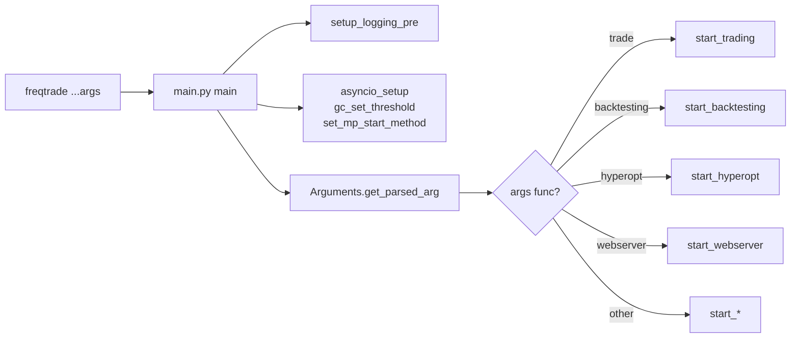
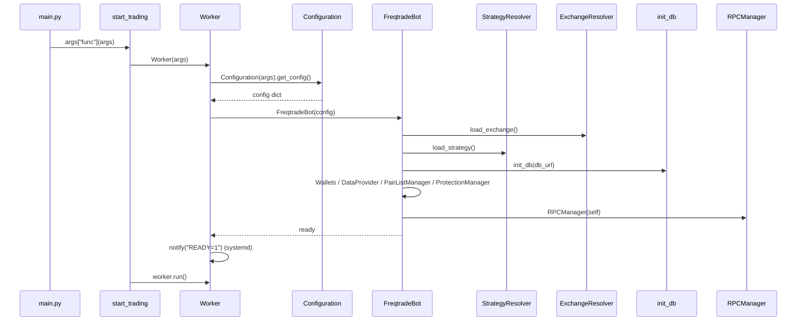
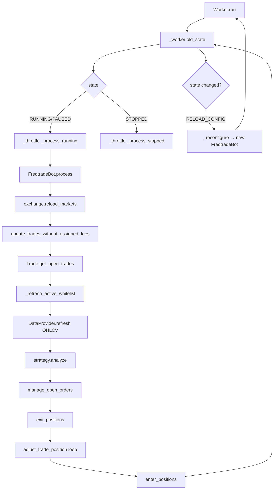
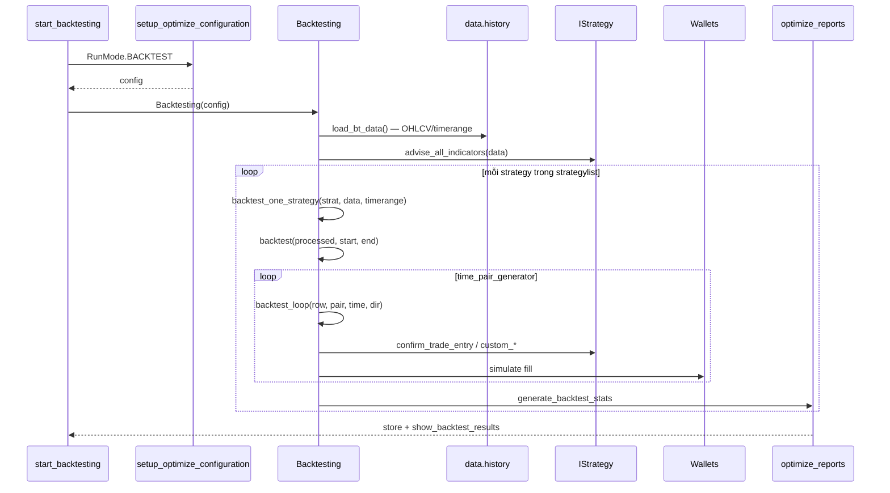
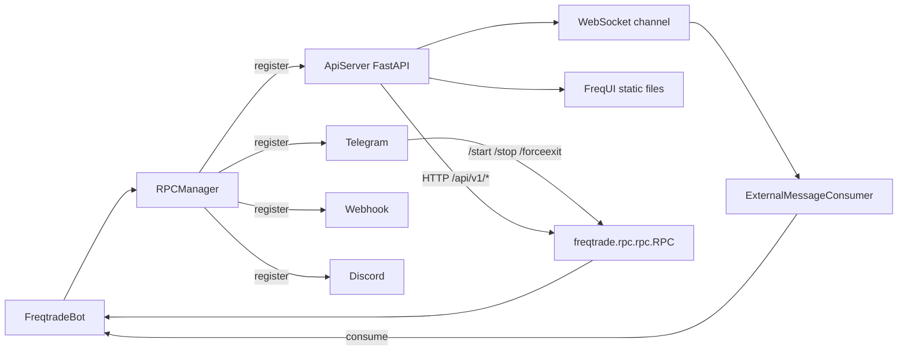
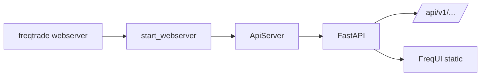
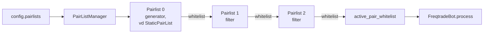
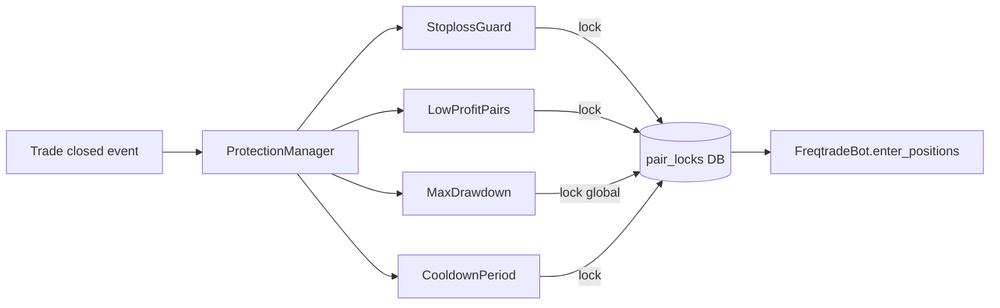
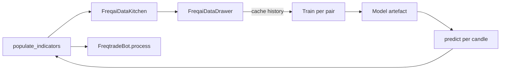
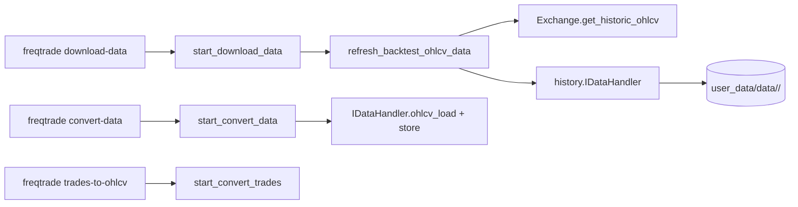

# 02. Các code flow chính của Freqtrade

Tài liệu này dẫn bạn qua **năm luồng** code quan trọng nhất, theo đúng
thứ tự gọi hàm trong mã nguồn. Mỗi flow đều có sơ đồ và link tới file/dòng
cụ thể để bạn tra cứu thẳng IDE.

> Mọi đường dẫn ở dạng tương đối từ thư mục này về repo root. Mở
> [`freqtrade/main.py`](../../freqtrade/main.py) để bắt đầu đọc cùng.

## Mục lục

- [Tầng 0 — CLI dispatcher (chung mọi flow)](#tầng-0--cli-dispatcher-chung-mọi-flow)
- [Flow A — Live / Dry-run trade](#flow-a--live--dry-run-trade)
- [Flow B — Backtesting](#flow-b--backtesting)
- [Flow C — Hyperopt](#flow-c--hyperopt)
- [Flow D — REST API + WebUI + Telegram + Webhook](#flow-d--rest-api--webui--telegram--webhook)
- [Flow E — Pairlist & Protection chain](#flow-e--pairlist--protection-chain)
- [Flow phụ — FreqAI training/inference](#flow-phụ--freqai-traininginference)
- [Flow phụ — Data download / convert](#flow-phụ--data-download--convert)

---

## Tầng 0 — CLI dispatcher (chung mọi flow)

Mọi sub-command đi qua duy nhất một entry point:



- File: [`freqtrade/main.py`](../../freqtrade/main.py).
- Argparse được dựng bởi `Arguments` ở
  [`freqtrade/commands/arguments.py`](../../freqtrade/commands/arguments.py)
  với danh mục option ở
  [`freqtrade/commands/cli_options.py`](../../freqtrade/commands/cli_options.py).
- Mỗi sub-command map sang hàm `start_*` thông qua `set_defaults(func=...)`
  trong `arguments.py`.
- `__init__.py` của package commands re-export tất cả `start_*` để dễ
  import:
  [`freqtrade/commands/__init__.py`](../../freqtrade/commands/__init__.py).
- Lỗi được phân loại bằng cây
  [`freqtrade/exceptions.py`](../../freqtrade/exceptions.py); `main()`
  bắt và trả mã thoát:
  - `KeyboardInterrupt` → 130 (SIGINT).
  - `ConfigurationError` → 1.
  - `FreqtradeException` → 2.
  - Mọi `Exception` khác → 1 (kèm traceback).

---

## Flow A — Live / Dry-run trade

Đây là flow **chạy lâu nhất** — vòng lặp giao dịch không kết thúc cho đến
khi có lệnh stop.

### A.1. Khởi tạo



Code tham chiếu:

- [`freqtrade/commands/trade_commands.py`](../../freqtrade/commands/trade_commands.py)
  — `start_trading()` đăng ký SIGTERM handler, tạo `Worker`, gọi
  `worker.run()`, `worker.exit()` trong `finally`.
- [`freqtrade/worker.py`](../../freqtrade/worker.py) — `Worker.__init__`
  → `_init(False)` → `Configuration(...).get_config()` →
  `FreqtradeBot(config)`.
- [`freqtrade/freqtradebot.py:79`](../../freqtrade/freqtradebot.py) —
  constructor ráp các thành phần.

### A.2. Vòng lặp `Worker.run()`



Hàm chính:

- `_throttle(func, throttle_secs, timeframe, timeframe_offset)`: đo thời
  gian thực thi, ngủ phần dư, canh nến mới — xem
  [`freqtrade/worker.py:145`](../../freqtrade/worker.py).
- `FreqtradeBot.process()` — orchestrator, code ở
  [`freqtrade/freqtradebot.py:257`](../../freqtrade/freqtradebot.py):
  - `update_trades_without_assigned_fees()` — `:449`.
  - `_refresh_active_whitelist()` — `:338`.
  - `manage_open_orders()` — `:1585`.
  - `exit_positions()` — `:1298`.
  - `enter_positions()` — `:613`.

Mỗi bước trên gọi tiếp:

- `Exchange.create_order(...)` (dry-run sẽ giả lập qua
  [`freqtrade/exchange/exchange.py`](../../freqtrade/exchange/exchange.py)
  và ghi vào DB).
- `Trade.session.add(...)` / `Order.session.add(...)` — SQLAlchemy commit
  qua context của `Trade`.
- `RPCManager.send_msg(...)` — phát tin nhắn ra Telegram/Webhook/WS.

### A.3. Tín hiệu thoát

- `SIGTERM` (kill, docker stop): `start_trading()` đăng ký `term_handler`
  → raise `KeyboardInterrupt`.
- `Ctrl+C`: `KeyboardInterrupt` được bắt ở `main()`, exit code 130.
- `worker.exit()` cleanup `FreqtradeBot.cleanup()`
  ([`freqtradebot.py:203`](../../freqtrade/freqtradebot.py)) — đóng
  exchange session, gửi message "process died" qua RPC, đóng DB.
- `OperationalException` trong `_process_running` → đặt state về
  `STOPPED`, gửi traceback ra Telegram.

### A.4. Bản đồ file Flow A

| Lớp | File chính |
|-----|------------|
| CLI | [`commands/arguments.py`](../../freqtrade/commands/arguments.py), [`commands/cli_options.py`](../../freqtrade/commands/cli_options.py) |
| Bootstrap | [`commands/trade_commands.py`](../../freqtrade/commands/trade_commands.py), [`worker.py`](../../freqtrade/worker.py) |
| Config | [`configuration/configuration.py`](../../freqtrade/configuration/configuration.py), [`configuration/load_config.py`](../../freqtrade/configuration/load_config.py), [`configuration/config_validation.py`](../../freqtrade/configuration/config_validation.py) |
| Core orchestrator | [`freqtradebot.py`](../../freqtrade/freqtradebot.py) |
| Strategy IF | [`strategy/interface.py`](../../freqtrade/strategy/interface.py), [`strategy/strategy_wrapper.py`](../../freqtrade/strategy/strategy_wrapper.py) |
| Exchange | [`exchange/exchange.py`](../../freqtrade/exchange/exchange.py), per-exchange overrides |
| Persistence | [`persistence/trade_model.py`](../../freqtrade/persistence/trade_model.py) |
| Wallets | [`wallets.py`](../../freqtrade/wallets.py) |
| Pairlist/Protection | [`plugins/pairlistmanager.py`](../../freqtrade/plugins/pairlistmanager.py), [`plugins/protectionmanager.py`](../../freqtrade/plugins/protectionmanager.py) |
| Data | [`data/dataprovider.py`](../../freqtrade/data/dataprovider.py) |
| RPC | [`rpc/rpc_manager.py`](../../freqtrade/rpc/rpc_manager.py) |

---

## Flow B — Backtesting

Backtesting **không có vòng lặp throttling**: nó nạp dữ liệu một lần,
duyệt nến tuần tự, mô phỏng entry/exit và xuất report.



Tham chiếu code:

- [`freqtrade/commands/optimize_commands.py:45`](../../freqtrade/commands/optimize_commands.py)
  — `start_backtesting(args)`.
- [`freqtrade/optimize/backtesting.py:121`](../../freqtrade/optimize/backtesting.py)
  — `Backtesting.__init__` (load resolver, exchange, dataprovider).
- [`freqtrade/optimize/backtesting.py:1843`](../../freqtrade/optimize/backtesting.py)
  — `Backtesting.start()`:
  1. `load_bt_data()` — nạp OHLCV qua
     [`freqtrade/data/history`](../../freqtrade/data/history/).
  2. `load_prior_backtest()` — nếu có cache hợp lệ thì tái dùng (xem hằng
     `BACKTEST_CACHE_AGE` trong `constants.py`).
  3. Lặp `strategylist`, gọi `backtest_one_strategy` →
     `advise_all_indicators` → `backtest()`.
- [`freqtrade/optimize/backtesting.py:1697`](../../freqtrade/optimize/backtesting.py)
  — `backtest()`:
  - `reset_backtest()`, `wallets.update()`.
  - `_get_ohlcv_as_lists(processed)` chuyển DataFrame → dict[list] cho
    nhanh.
  - `time_pair_generator(...)` sinh tuple `(time, pair, row, is_last,
    trade_dir)`.
  - `backtest_loop(...)` mô phỏng từng nến: kiểm tra exit của trade đang
    mở (stoploss/ROI/exit signal/custom_*), kiểm tra entry mới, gọi các
    callback strategy với wrapper an toàn.
  - `handle_left_open(...)` đóng các vị thế còn mở khi hết timerange.
- Output ghi qua
  [`freqtrade/optimize/optimize_reports/`](../../freqtrade/optimize/optimize_reports/)
  thành file JSON trong `user_data/backtest_results/` và in bảng đẹp ra
  console.

Lưu ý quan trọng:

- **Một call backtest đầy đủ là invariant input cho hyperopt** — Hyperopt
  gọi `Backtesting.backtest()` lặp đi lặp lại, vì vậy `backtest()` được
  giữ tối ưu, hạn chế log, không tái cấu hình I/O.
- Nếu strategy có `process_only_new_candles = False`, backtest vẫn chỉ
  gọi callback **một lần / nến** — bạn không thể tái tạo "tần suất giây"
  trong backtest, trừ khi dùng `--timeframe-detail 1m`.

---

## Flow C — Hyperopt

Hyperopt = backtest lặp + tối ưu hoá tham số bằng Optuna.

```mermaid
sequenceDiagram
    participant CLI as start_hyperopt
    participant Lock as filelock
    participant H as Hyperopt
    participant Opt as HyperOptimizer
    participant Optuna as optuna.Study
    participant Bt as Backtesting.backtest
    participant Loss as IHyperOptLoss
    CLI->>Lock: acquire hyperopt.lock
    CLI->>H: Hyperopt(config)
    H->>Opt: HyperOptimizer(config, data_pickle_file)
    H->>H: prepare_hyperopt() (warm-up data)
    H->>Optuna: get_optimizer(random_state)
    loop epoch tới total_epochs
        H->>Optuna: opt.ask(dimensions)
        Optuna-->>H: asked params
        H->>Opt: generate_optimizer(params)
        Opt->>Bt: backtest(processed)
        Bt-->>Opt: results
        Opt->>Loss: hyperopt_loss_function(...)
        Loss-->>Opt: loss
        Opt-->>H: f_val { loss, params, results }
        H->>Optuna: opt.tell(asked, loss)
        H->>H: evaluate_result -> _save_result -> .fthypt
    end
    H->>H: print_best, save best params
```

Code:

- [`freqtrade/commands/optimize_commands.py:81`](../../freqtrade/commands/optimize_commands.py)
  — `start_hyperopt(args)` lấy `FileLock` để chống chạy song song nhiều
  instance, sau đó tạo `Hyperopt(config)` và gọi `start()`.
- [`freqtrade/optimize/hyperopt/hyperopt.py:35`](../../freqtrade/optimize/hyperopt/hyperopt.py)
  — `Hyperopt.__init__` chuẩn bị file kết quả `.fthypt`,
  `HyperOptimizer`, `HyperoptOutput`.
- [`freqtrade/optimize/hyperopt/hyperopt.py:219`](../../freqtrade/optimize/hyperopt/hyperopt.py)
  — `Hyperopt.start()`:
  1. `_set_random_state`, `prepare_hyperopt()` (load + cache OHLCV).
  2. `get_optimizer(random_state)` — Optuna study (TPE / CmaEs /
     AutoSampler tuỳ config).
  3. Vòng `for i in range(evals)`:
     - `get_asked_points(n_points, dimensions)` lấy tham số mới, lọc
       trùng (`duplicate_optuna_asked_points`).
     - `run_optimizer_parallel(...)` (qua `joblib.Parallel`) gọi
       `HyperOptimizer.generate_optimizer(params)` cho từng job — mỗi
       job sẽ patch tham số vào strategy và chạy
       `Backtesting.backtest(processed, start, end)`.
     - `opt.tell(asked, loss)` để Optuna học.
     - `evaluate_result(val, current, is_random)` → log đẹp +
       `_save_result(val)` ghi 1 dòng vào `.fthypt`.
- [`freqtrade/optimize/hyperopt/hyperopt_optimizer.py`](../../freqtrade/optimize/hyperopt/hyperopt_optimizer.py)
  — chứa `HyperOptimizer` (build dimensions từ
  `IntParameter/DecimalParameter/...` của strategy, sinh `params`, gọi
  `Backtesting.backtest`, đo loss).
- Loss functions:
  [`freqtrade/optimize/hyperopt_loss/`](../../freqtrade/optimize/hyperopt_loss/)
  — kế thừa `IHyperOptLoss`. Mặc định
  `ShortTradeDurHyperOptLoss`, các loss khác trong hằng
  `HYPEROPT_LOSS_BUILTIN`. Bạn có thể tự viết loss đặt vào
  `user_data/hyperopts/`.

Đầu ra: `.fthypt` (1 epoch / dòng JSON) + `.last_result.json`. Phân tích
qua `freqtrade hyperopt-list`, `freqtrade hyperopt-show -n <best>`.

---

## Flow D — REST API + WebUI + Telegram + Webhook

Tất cả "kênh ngoài" đều đi qua **một** lớp orchestrator:
[`RPCManager`](../../freqtrade/rpc/rpc_manager.py).



Tham chiếu:

- [`freqtrade/rpc/rpc_manager.py`](../../freqtrade/rpc/rpc_manager.py) —
  `RPCManager` instantiate các handler tương ứng với cấu hình:
  - `Telegram` nếu `telegram.enabled`.
  - `ApiServer` (FastAPI + Uvicorn) nếu `api_server.enabled`.
  - `Webhook` nếu `webhook.enabled`.
  - `Discord` nếu `discord.enabled`.
  - `ExternalMessageConsumer` nếu `external_message_consumer.enabled`.
- [`freqtrade/rpc/rpc.py`](../../freqtrade/rpc/rpc.py) — class `RPC` chứa
  toàn bộ thao tác mức nghiệp vụ (status, balance, profit, forcebuy,
  forceexit, reload_config, ...). Telegram và REST chỉ là **lớp transport**
  gọi tới các method của `RPC`.
- [`freqtrade/rpc/api_server/`](../../freqtrade/rpc/api_server/) — FastAPI
  app:
  - `webserver.py` khởi server qua `UvicornServer` chạy trong thread riêng.
  - `api_v1.py`, `api_trading.py`, `api_backtest.py`,
    `api_pair_history.py`, `api_pairlists.py`, `api_download_data.py`,
    `api_background_tasks.py`, `api_ws.py` — chia route theo nhóm.
  - `api_auth.py` — JWT auth.
  - `web_ui.py` — phục vụ static UI từ
    `freqtrade/rpc/api_server/ui/installed/` (sau khi
    `freqtrade install-ui`).
- [`freqtrade/rpc/telegram.py`](../../freqtrade/rpc/telegram.py) — handler
  cho `python-telegram-bot`. Mỗi command (`/status`, `/profit`, ...) map
  thẳng tới method `RPC.<...>`.
- [`freqtrade/rpc/webhook.py`](../../freqtrade/rpc/webhook.py) — đẩy event
  ra HTTP endpoint của bạn (Slack, Discord, custom).
- [`freqtrade/rpc/external_message_consumer.py`](../../freqtrade/rpc/external_message_consumer.py)
  — chế độ "consumer" để nhận tín hiệu từ bot khác qua WebSocket (xem
  [`docs/producer-consumer.md`](../producer-consumer.md)).

Khi bot có sự kiện (entry, exit, protection trigger, exception):
`FreqtradeBot.notify_*` → `RPCManager.send_msg(msg)` → fan-out tới mọi
handler đã register.

### Flow webserver (chế độ chỉ UI/API)



`freqtrade webserver` chạy không có bot trade nào — chỉ phục vụ UI và các
endpoint `backtest`, `pair_history`, `pairlist`. Hữu ích để host UI trên
server riêng, kết nối tới backtest result. Code:
[`freqtrade/commands/webserver_commands.py`](../../freqtrade/commands/webserver_commands.py).

---

## Flow E — Pairlist & Protection chain

Pairlist và Protection đều là **chuỗi plugin** chạy theo thứ tự khai báo
trong config.

### Pairlist chain



- `PairListManager` ở
  [`freqtrade/plugins/pairlistmanager.py`](../../freqtrade/plugins/pairlistmanager.py)
  load các handler qua
  [`freqtrade/resolvers/pairlist_resolver.py`](../../freqtrade/resolvers/pairlist_resolver.py).
- Plugin đầu tiên là **generator** (`gen_pairlist`), các plugin sau là
  **filter** (`filter_pairlist`). Danh sách built-in trong hằng
  `AVAILABLE_PAIRLISTS` (`constants.py`):
  - Generator: `StaticPairList`, `VolumePairList`, `MarketCapPairList`,
    `PercentChangePairList`, `RemotePairList`, `ProducerPairList`,
    `CrossMarketPairList`.
  - Filter: `AgeFilter`, `DelistFilter`, `FullTradesFilter`,
    `OffsetFilter`, `PerformanceFilter`, `PrecisionFilter`,
    `PriceFilter`, `RangeStabilityFilter`, `ShuffleFilter`,
    `SpreadFilter`, `VolatilityFilter`.
- Mỗi handler kế thừa
  [`IPairList`](../../freqtrade/plugins/pairlist/IPairList.py): override
  `gen_pairlist` hoặc `filter_pairlist`/`_validate_pair`.

### Protection chain



- `ProtectionManager` ở
  [`freqtrade/plugins/protectionmanager.py`](../../freqtrade/plugins/protectionmanager.py)
  duyệt từng `IProtection`, gọi `global_stop()` /
  `stop_per_pair()` mỗi khi có trade đóng.
- Mỗi protection trả về `ProtectionReturn(lock_pair, lock_until, reason,
  lock_side)`. `PairLocks.lock_pair(...)` ghi vào DB.
- Khi `enter_positions()` xét entry, nó kiểm tra `PairLocks.is_pair_locked`
  trước.

---

## Flow phụ — FreqAI training/inference



- Bật bằng `freqai.enabled = true` trong config.
- Resolver:
  [`freqtrade/resolvers/freqaimodel_resolver.py`](../../freqtrade/resolvers/freqaimodel_resolver.py).
- Interface chính:
  [`freqtrade/freqai/freqai_interface.py`](../../freqtrade/freqai/freqai_interface.py)
  (~46K dòng) — chứa `IFreqaiModel.start(...)`, train/predict per pair.
- `data_drawer.py` quản lý lưu trữ artefact, `data_kitchen.py` xử lý
  feature engineering, normalization, train/test split, outlier removal
  qua [datasieve](https://github.com/emergentmethods/datasieve).
- Reinforcement Learning ở
  [`freqtrade/freqai/RL/`](../../freqtrade/freqai/RL/) (gymnasium +
  stable-baselines3).

Strategy gọi FreqAI qua `self.freqai.start(dataframe, metadata)` trong
`populate_indicators`. Xem
[`docs/freqai-running.md`](../freqai-running.md) cho chi tiết.

---

## Flow phụ — Data download / convert



- Code: [`freqtrade/commands/data_commands.py`](../../freqtrade/commands/data_commands.py).
- Định dạng hỗ trợ (hằng `AVAILABLE_DATAHANDLERS`): `json`, `jsongz`,
  `feather`, `parquet`. Implementation ở
  [`freqtrade/data/history/`](../../freqtrade/data/history/) (`featherdatahandler.py`,
  `jsondatahandler.py`, `parquetdatahandler.py`).

---

## Tổng kết: bản đồ "tôi cần đổi cái này, sửa ở đâu?"

| Tôi muốn… | Sửa ở… |
|-----------|--------|
| Thay đổi tần suất iteration | `internals.process_throttle_secs` (config) |
| Thêm sub-command CLI | [`commands/arguments.py`](../../freqtrade/commands/arguments.py) + tạo `start_*` mới |
| Thêm option CLI | [`commands/cli_options.py`](../../freqtrade/commands/cli_options.py) |
| Thêm field config | [`config_schema/`](../../freqtrade/config_schema/) + `configuration/config_validation.py` |
| Thêm pairlist | [`plugins/pairlist/`](../../freqtrade/plugins/pairlist/) + `constants.AVAILABLE_PAIRLISTS` |
| Thêm protection | [`plugins/protections/`](../../freqtrade/plugins/protections/) |
| Thêm hyperopt loss | [`optimize/hyperopt_loss/`](../../freqtrade/optimize/hyperopt_loss/) |
| Sửa logic exit | `FreqtradeBot.exit_positions` + `IStrategy.custom_exit/custom_stoploss` |
| Sửa logic vào lệnh | `FreqtradeBot.enter_positions` |
| Thêm sàn mới | [`exchange/<sàn>.py`](../../freqtrade/exchange/) + register ở `exchange/__init__.py` |
| Thêm endpoint REST | [`rpc/api_server/api_v1.py`](../../freqtrade/rpc/api_server/api_v1.py) (hoặc tạo file `api_*.py` mới) |
| Thêm Telegram command | [`rpc/telegram.py`](../../freqtrade/rpc/telegram.py) (map → `RPC.<method>`) |
| Sửa migration DB | [`persistence/migrations.py`](../../freqtrade/persistence/migrations.py) |

Tiếp theo: [03. Hướng dẫn build](03-huong-dan-build.md).
