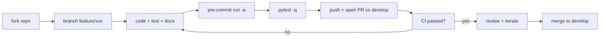

# 06. Hướng dẫn phát triển

Tài liệu này dành cho **coder** muốn đóng góp PR upstream hoặc fork
Freqtrade để phát triển nội bộ. Đọc trước:
[01](01-nguyen-tac-hoat-dong.md), [02](02-code-flow-chinh.md),
[03](03-huong-dan-build.md). Tham chiếu gốc:
[`docs/developer.md`](../developer.md), [`CONTRIBUTING.md`](../../CONTRIBUTING.md).

## Mục lục

- [1. Quy ước đóng góp](#1-quy-ước-đóng-góp)
- [2. Cấu trúc package chi tiết](#2-cấu-trúc-package-chi-tiết)
- [3. Code style & quy tắc](#3-code-style--quy-tắc)
- [4. Pre-commit & CI](#4-pre-commit--ci)
- [5. Thêm Pairlist / Protection](#5-thêm-pairlist--protection)
- [6. Thêm Hyperopt loss](#6-thêm-hyperopt-loss)
- [7. Thêm sàn (Exchange)](#7-thêm-sàn-exchange)
- [8. Thêm CLI sub-command](#8-thêm-cli-sub-command)
- [9. Thêm REST endpoint / Telegram command](#9-thêm-rest-endpoint--telegram-command)
- [10. Persistence & migration](#10-persistence--migration)
- [11. FreqAI development](#11-freqai-development)
- [12. Hệ thống test](#12-hệ-thống-test)
- [13. Debug](#13-debug)
- [14. ft_client SDK](#14-ft_client-sdk)
- [15. Quy trình release](#15-quy-trình-release)

---

## 1. Quy ước đóng góp

Theo [`CONTRIBUTING.md`](../../CONTRIBUTING.md):

- **PR luôn nhắm vào nhánh `develop`**, không phải `stable`.
- Tiếng Anh trong commit message, comment code, tên biến.
- Tính năng mới phải có **unit test**, pass CI, kèm cập nhật docs.
- PR có thể là **draft** để xin feedback sớm.
- Nếu dùng AI hỗ trợ, **ghi rõ trong PR description**, tự review kỹ
  trước khi đẩy. Commit phải thuộc tài khoản người (không phải account
  AI).
- Tránh PR khổng lồ — chia nhỏ theo feature.
- Trao đổi tính năng lớn ở Discord (#dev) hoặc issue trước khi code.

Quy trình PR khuyến nghị:



---

## 2. Cấu trúc package chi tiết

Mở rộng cấu trúc đã liệt kê ở
[01 §4.1](01-nguyen-tac-hoat-dong.md#41-cây-thư-mục-cốt-lõi):

| Thư mục / File | Vai trò |
|----------------|---------|
| [`commands/`](../../freqtrade/commands/) | CLI: `arguments.py` (argparse), `cli_options.py` (option), `*_commands.py` (`start_*`) |
| [`configuration/`](../../freqtrade/configuration/) | Đọc / merge / validate config + env vars + JSON schema (`config_validation.py`, `load_config.py`) |
| [`config_schema/`](../../freqtrade/config_schema/) | JSON Schema mô tả từng field config (auto-extract bởi pre-commit hook) |
| [`data/`](../../freqtrade/data/) | `dataprovider.py` (cache OHLCV cho strategy), `history/` (data handler đọc/ghi feather/parquet/json), `btanalysis/` (load backtest stats), `metrics.py` (Sharpe/Sortino/...), `converter/` (DataFrame conversion) |
| [`exchange/`](../../freqtrade/exchange/) | `exchange.py` (base class wrap ccxt), per-exchange override (`binance.py`, `bybit.py`, ...), `common.py` (decorator retry/DDOS), `exchange_ws.py` (websocket), `exchange_utils*.py` (timeframe, contract size) |
| [`freqai/`](../../freqtrade/freqai/) | ML pipeline: `freqai_interface.py` (`IFreqaiModel`), `data_kitchen.py` (feature/PCA/SVM), `data_drawer.py` (artefact store), `base_models/`, `prediction_models/`, `RL/`, `torch/` |
| [`ft_types/`](../../freqtrade/ft_types/) | TypedDict / dataclass cho backtest results, schemas |
| [`leverage/`](../../freqtrade/leverage/) | Tính liquidation price, contract maintenance margin, isolated/cross |
| [`loggers/`](../../freqtrade/loggers/) | Setup logging (`setup_logging`, `setup_logging_pre`), file rotation, syslog/journald |
| [`mixins/`](../../freqtrade/mixins/) | `LoggingMixin`, `MeasureTime`, helper traits dùng chung |
| [`optimize/`](../../freqtrade/optimize/) | `backtesting.py` (Backtesting class), `hyperopt/` (Optuna driver), `hyperopt_loss/` (loss function), `optimize_reports/` (xuất report), `analysis/` (lookahead/recursive) |
| [`persistence/`](../../freqtrade/persistence/) | SQLAlchemy models: `trade_model.py` (Trade/Order/LocalTrade), `pairlock.py`, `key_value_store.py`, `custom_data.py`, `migrations.py` (alembic-style), `wallet_history.py` |
| [`plot/`](../../freqtrade/plot/) | `plotly` helper cho `plot-dataframe`/`plot-profit` |
| [`plugins/`](../../freqtrade/plugins/) | `pairlistmanager.py`, `protectionmanager.py`, `pairlist/<Plugin>.py`, `protections/<Plugin>.py` |
| [`resolvers/`](../../freqtrade/resolvers/) | Loader động: `iresolver.py` (base), `strategy_resolver.py`, `exchange_resolver.py`, `pairlist_resolver.py`, `protection_resolver.py`, `hyperopt_resolver.py`, `freqaimodel_resolver.py` |
| [`rpc/`](../../freqtrade/rpc/) | `rpc_manager.py` (orchestrator), `rpc.py` (business logic), `telegram.py`, `webhook.py`, `discord.py`, `external_message_consumer.py`, `api_server/` (FastAPI app) |
| [`strategy/`](../../freqtrade/strategy/) | `interface.py` (IStrategy), `parameters.py` (hyperopt param), `hyper.py` (HyperStrategyMixin), `strategy_wrapper.py` (`strategy_safe_wrapper`), `informative_decorator.py`, `strategyupdater.py`, `strategy_validation.py`, `strategy_helper.py` |
| [`system/`](../../freqtrade/system/) | `asyncio_setup`, `gc_set_threshold`, `set_mp_start_method`, `print_version_info` |
| [`templates/`](../../freqtrade/templates/) | `sample_strategy.py`, `sample_hyperopt_loss.py`, `FreqaiExampleStrategy.py`, `base_*.j2` (Jinja2 cho `new-strategy/new-config`) |
| [`util/`](../../freqtrade/util/) | `dt_now`, `dt_ts`, `FtPrecise`, `MeasureTime`, `PeriodicCache`, `migrations`, `progressbar`, `rich_progress`, `binance_mig` |
| [`vendor/`](../../freqtrade/vendor/) | Mã của bên thứ ba được fork vào — **không** áp dụng ruff/mypy đầy đủ |
| [`enums/`](../../freqtrade/enums/) | `RunMode`, `State`, `ExitType`, `RPCMessageType`, `SignalDirection`, `MarginMode`, `TradingMode`, ... |
| [`constants.py`](../../freqtrade/constants.py) | Hằng số: `PROCESS_THROTTLE_SECS`, `AVAILABLE_PAIRLISTS`, `HYPEROPT_LOSS_BUILTIN`, types `Config`, `LongShort`, ... |
| [`exceptions.py`](../../freqtrade/exceptions.py) | Cây exception |
| [`freqtradebot.py`](../../freqtrade/freqtradebot.py) | Class `FreqtradeBot` ~2500 dòng — orchestrator chính |
| [`worker.py`](../../freqtrade/worker.py) | `Worker` — vòng lặp throttling |
| [`main.py`](../../freqtrade/main.py) | Entry point CLI |
| [`__init__.py`](../../freqtrade/__init__.py) | `__version__` |
| [`__main__.py`](../../freqtrade/__main__.py) | Cho phép `python -m freqtrade ...` |

Các thư mục cấp repo:

| Path | Vai trò |
|------|---------|
| [`tests/`](../../tests/) | Unit + integration test (pytest), fixture trong `conftest.py`, dữ liệu mẫu trong `testdata/` |
| [`ft_client/`](../../ft_client/) | SDK Python độc lập (`freqtrade-client`) gọi REST API |
| [`docs/`](../) | Site docs MkDocs |
| [`build_helpers/`](../../build_helpers/) | Script CI: `extract_config_json_schema.py`, build wheel/Docker |
| [`docker/`](../../docker/) | Dockerfile biến thể |
| [`config_examples/`](../../config_examples/) | Config mẫu |
| [`scripts/`](../../scripts/) | Script utility (rebuild, release tools) |
| [`user_data/`](../../user_data/) | Workspace mẫu / runtime |

### Cây exception

```
FreqtradeException
├── OperationalException        (lỗi config, dừng bot)
│   └── ConfigurationError
├── DependencyException         (thiếu điều kiện, ví dụ thiếu balance)
│   ├── PricingError
│   └── ExchangeError
│       ├── TemporaryError
│       │   └── DDosProtection
│       └── InvalidOrderException
│           ├── RetryableOrderError
│           └── InsufficientFundsError
└── StrategyError               (lỗi user code)
```

`FreqtradeBot` xử lý exception khác nhau cho từng loại. Tham chiếu
[`freqtrade/exceptions.py`](../../freqtrade/exceptions.py).

---

## 3. Code style & quy tắc

Cấu hình ở [`pyproject.toml`](../../pyproject.toml):

- **ruff** (`[tool.ruff]` + `[tool.ruff.lint]`) — thay flake8 + isort.
  - `line-length = 100`.
  - Rule mở rộng: `C90, B, F, E, W, UP, I, A, TID, YTT, S, PTH, RUF, ASYNC, NPY`.
  - Ignore: `B007, B904, S603, S607, S608, ...`.
  - `max-complexity = 12` (mccabe).
- **mypy** (`[tool.mypy]`) — type check, plugin SQLAlchemy, ignore tests.
- **pyright** (`[tool.pyright]`) — bổ sung, mặc định `typeCheckingMode = "off"`.
- **codespell** — phát hiện sai chính tả.
- **flake8** legacy config có (chỉ để compatibility), ưu tiên ruff.

Quy tắc bổ sung (theo [`CONTRIBUTING.md`](../../CONTRIBUTING.md)):

- Docstring **bắt buộc** cho mọi public method.
- Dùng **double-quote** cho docstring.
- Multi-line docstring align với dấu nháy đầu tiên.
- Format theo reST: `:param x:`, `:return:`, `:raises Y:`.
- Log lỗi: ưu tiên f-string trong code thường; trong tight loop của
  `Backtesting.backtest`, **tránh log nặng**.
- `LoggingMixin` cung cấp `self.log_once(msg, level)` để log không bị
  spam.
- `Wallets` / `Trade` / `Order` luôn được lấy qua DB session — không
  cache state ngoài.

Lệnh check:

```powershell
ruff check .
ruff format --check .
ruff format .            # auto-fix
mypy freqtrade
pre-commit run -a
```

---

## 4. Pre-commit & CI

[`.pre-commit-config.yaml`](../../.pre-commit-config.yaml) chạy các hook:

| Hook | Repo | Mục đích |
|------|------|---------|
| `extract-config-json-schema` | local | Đảm bảo `config_schema/` đồng bộ với `Config` types |
| `mypy` | mirrors-mypy | Type check |
| `ruff`, `ruff-format` | charliermarsh/ruff-pre-commit | Lint + format |
| `end-of-file-fixer`, `mixed-line-ending`, `debug-statements`, `check-ast`, `trailing-whitespace` | pre-commit-hooks | File hygiene |
| `strip-exif` | exif-stripper | Xoá EXIF khỏi ảnh |
| `codespell` | codespell-project | Sai chính tả |
| `zizmor` | woodruffw/zizmor | Audit GitHub Actions workflow |

Cài hook:

```powershell
pre-commit install                # cài git hook
pre-commit run -a                 # chạy thủ công toàn repo
pre-commit autoupdate             # nâng cấp hook (bot tự làm qua workflow)
```

CI workflow nằm tại [`.github/workflows/`](../../.github/workflows/):

| Workflow | File | Khi nào chạy |
|----------|------|--------------|
| Build & test toàn diện | [`ci.yml`](../../.github/workflows/ci.yml) | Mọi PR / push |
| Build Docker multi-arch | [`docker-build.yml`](../../.github/workflows/docker-build.yml) | Push develop/stable + cron |
| Deploy docs | [`deploy-docs.yml`](../../.github/workflows/deploy-docs.yml) | Push docs |
| Devcontainer build | [`devcontainer-build.yml`](../../.github/workflows/devcontainer-build.yml) | Định kỳ |
| Update Binance leverage tier | [`binance-lev-tier-update.yml`](../../.github/workflows/binance-lev-tier-update.yml) | Schedule |
| Audit Actions | [`zizmor_action.yml`](../../.github/workflows/zizmor_action.yml) | PR đụng `.github/` |
| Cleanup ghcr | [`packages-cleanup.yml`](../../.github/workflows/packages-cleanup.yml) | Schedule |
| Auto-update pre-commit | [`pre-commit-update.yml`](../../.github/workflows/pre-commit-update.yml) | Schedule |
| Update README ở Dockerhub | [`docker-update-readme.yml`](../../.github/workflows/docker-update-readme.yml) | Push README |

CI chạy trên **Linux + macOS + Windows** với Python 3.11–3.14 (xem
matrix trong `ci.yml`).

---

## 5. Thêm Pairlist / Protection

Theo [`docs/developer.md`](../developer.md) §Plugins.

### 5.1. Pairlist mới

1. Copy [`freqtrade/plugins/pairlist/VolumePairList.py`](../../freqtrade/plugins/pairlist/VolumePairList.py)
   → đổi tên file & class (ví dụ `MyVolumeFilter.py`).
2. Kế thừa
   [`IPairList`](../../freqtrade/plugins/pairlist/IPairList.py).
3. Chọn rôle:
   - **Generator** → override `gen_pairlist()`.
   - **Filter** → override `filter_pairlist()` hoặc `_validate_pair()`.
4. Thêm `short_desc()` (Telegram message).
5. Đăng ký tên class vào hằng `AVAILABLE_PAIRLISTS` trong
   [`freqtrade/constants.py`](../../freqtrade/constants.py).
6. Cache compute / network heavy:
   ```python
   from cachetools import TTLCache
   self._cache = TTLCache(maxsize=1, ttl=self._refresh_period)
   ```
7. Test: thêm `tests/plugins/test_pairlist.py::test_my_volume_filter`,
   tham chiếu test có sẵn cho `VolumePairList`.

### 5.2. Protection mới

1. Copy [`freqtrade/plugins/protections/cooldown_period.py`](../../freqtrade/plugins/protections/cooldown_period.py).
2. Kế thừa
   [`IProtection`](../../freqtrade/plugins/protections/iprotection.py).
3. Implement:
   - `short_desc()` cho log/Telegram.
   - `global_stop()` (set `has_global_stop = True`) hoặc
     `stop_per_pair()` (set `has_local_stop = True`).
   - Trả `ProtectionReturn(lock_pair, lock_until, reason, lock_side)`.
4. Tính `lock_until` qua `self.calculate_lock_end(...)` để đảm bảo nhất
   quán.
5. Dùng `self._stop_duration`, `self._lookback_period` đã được parent
   class chuẩn hoá.
6. Test: `tests/plugins/test_protections.py`.
7. Resolver tự pick lên qua tên file/class — không cần đăng ký
   `constants.py`.

---

## 6. Thêm Hyperopt loss

1. Tạo file ở `user_data/hyperopts/MyLoss.py` (chạy từ user dir) hoặc
   `freqtrade/optimize/hyperopt_loss/hyperopt_loss_my.py` (đóng góp upstream).
2. Kế thừa
   [`IHyperOptLoss`](../../freqtrade/optimize/hyperopt_loss/hyperopt_loss_interface.py).
3. Implement static `hyperopt_loss_function(...)` trả `float` — càng
   thấp càng tốt.
4. Đăng ký vào `HYPEROPT_LOSS_BUILTIN` (chỉ với upstream).
5. Test: `tests/optimize/test_hyperoptloss.py`.

Tham khảo các loss đã có như
[`hyperopt_loss_sharpe_daily.py`](../../freqtrade/optimize/hyperopt_loss/hyperopt_loss_sharpe_daily.py).

---

## 7. Thêm sàn (Exchange)

Tham chiếu: [`docs/developer.md`](../developer.md) §Implement a new
Exchange.

### 7.1. Bước cơ bản

1. Hầu hết sàn ccxt đã chạy được mặc định qua
   [`Exchange`](../../freqtrade/exchange/exchange.py). Chỉ thêm class
   mới khi cần override (rate limit, stoploss-on-exchange, contract
   size, fund fee).
2. Tạo `freqtrade/exchange/<myexchange>.py`:

   ```python
   from freqtrade.exchange import Exchange

   class MyExchange(Exchange):
       _ft_has: dict = {
           "ohlcv_candle_limit": 500,
           "ohlcv_partial_candle": True,
           "trades_pagination": "id",
           "l2_limit_range": [10, 25, 100],
           "stoploss_on_exchange": True,
       }

       def stoploss(self, pair, amount, stop_price, ...):
           # exchange-specific implementation
           ...
   ```
3. Đăng ký trong
   [`freqtrade/exchange/__init__.py`](../../freqtrade/exchange/__init__.py)
   để `ExchangeResolver.load_exchange` tìm thấy.
4. Cập nhật `freqtrade/exchange/check_exchange.py` nếu sàn có constraint
   đặc biệt.

### 7.2. Test sàn mới

```powershell
pytest --longrun tests/exchange_online/test_ccxt_compat.py -k myexchange
```

Chạy trong devcontainer (cần network). Nếu sàn dùng futures, thêm config
vào `tests/exchange_online/conftest.py`.

### 7.3. Incomplete candle test

```python
import ccxt
from datetime import datetime, timezone
from freqtrade.data.converter import ohlcv_to_dataframe

ct = ccxt.myexchange()
raw = ct.fetch_ohlcv("BTC/USDT", timeframe="1d")
df = ohlcv_to_dataframe(raw, "1d", pair="BTC/USDT", drop_incomplete=False)
print(df.tail(1))
print(datetime.now(timezone.utc))
```

Quan sát ngày của nến cuối: nếu trùng ngày hiện tại → giữ
`ohlcv_partial_candle = True`.

### 7.4. Update binance leverage tier (cron)

Workflow [`binance-lev-tier-update.yml`](../../.github/workflows/binance-lev-tier-update.yml)
chạy script trong [`scripts/`](../../scripts/) để pull tier mới và
commit JSON cache.

---

## 8. Thêm CLI sub-command

1. Tạo file `freqtrade/commands/<your>_commands.py` với hàm `start_<your>(args)`.
2. Thêm option vào
   [`freqtrade/commands/cli_options.py`](../../freqtrade/commands/cli_options.py)
   (kế thừa `CLI_COMMON_OPTIONS` nếu phù hợp).
3. Đăng ký sub-command trong
   [`freqtrade/commands/arguments.py`](../../freqtrade/commands/arguments.py):
   - Thêm vào `_subparsers_for_*` group đúng nhóm.
   - Gán `set_defaults(func=start_<your>)`.
4. Re-export ở
   [`freqtrade/commands/__init__.py`](../../freqtrade/commands/__init__.py).
5. Tạo doc `docs/commands/<your>.md` (tự động auto-include qua
   `pymdownx.snippets`).
6. Test: `tests/commands/test_<your>.py`.

Ví dụ tham khảo: `start_show_config` trong
[`build_config_commands.py`](../../freqtrade/commands/build_config_commands.py).

---

## 9. Thêm REST endpoint / Telegram command

### 9.1. REST endpoint

1. Mở rộng [`freqtrade/rpc/rpc.py`](../../freqtrade/rpc/rpc.py): thêm
   method `_rpc_<name>(self, ...)` chứa logic nghiệp vụ.
2. Thêm route trong
   [`freqtrade/rpc/api_server/api_v1.py`](../../freqtrade/rpc/api_server/api_v1.py)
   (hoặc tạo file `api_<group>.py` mới rồi include vào
   `api_v1.router`):

   ```python
   from fastapi import APIRouter, Depends
   from freqtrade.rpc.api_server.deps import get_rpc

   router = APIRouter()

   @router.get("/my_endpoint", response_model=MyResponse, tags=["mygroup"])
   def my_endpoint(rpc=Depends(get_rpc)):
       return rpc._rpc_my_method()
   ```
3. Khai báo schema response/request ở
   [`api_schemas.py`](../../freqtrade/rpc/api_server/api_schemas.py).
4. Bump `API_VERSION` ở
   [`api_v1.py`](../../freqtrade/rpc/api_server/api_v1.py) nếu phá vỡ
   contract.
5. Auth: `Depends(http_basic_or_jwt)` (xem `api_auth.py`).
6. Test: `tests/rpc/test_rpc_apiserver.py`.

### 9.2. Telegram command

1. Thêm method `_<command>(self, update, context)` vào class `Telegram`
   ở [`freqtrade/rpc/telegram.py`](../../freqtrade/rpc/telegram.py).
2. Đăng ký vào `_init` của class qua `CommandHandler`.
3. Gọi sang `self._rpc.<rpc_method>` (logic nghiệp vụ ở `RPC`).
4. Cập nhật `notification_settings` và docs
   [`docs/telegram-usage.md`](../telegram-usage.md).

### 9.3. Webhook event mới

Thêm key vào `WebhookConfig` schema, gọi `self._rpc_send_msg(...)` ở
chỗ event xảy ra trong `FreqtradeBot`. Tham chiếu
[`freqtrade/rpc/webhook.py`](../../freqtrade/rpc/webhook.py).

---

## 10. Persistence & migration

### 10.1. Thêm field cho Trade/Order

1. Sửa
   [`freqtrade/persistence/trade_model.py`](../../freqtrade/persistence/trade_model.py):
   thêm `Mapped[<type>] = mapped_column(...)`.
2. Cập nhật `to_json()` / `from_json()` nếu field cần xuất qua API.
3. Viết migration trong
   [`freqtrade/persistence/migrations.py`](../../freqtrade/persistence/migrations.py)
   theo style alembic-like (thủ công kiểm tra schema rồi `ALTER TABLE`).
4. Cập nhật fixture `tests/conftest_trades*.py`.
5. Test: `tests/persistence/test_persistence.py`.

### 10.2. Key-value store

[`freqtrade/persistence/key_value_store.py`](../../freqtrade/persistence/key_value_store.py)
cho strategy lưu state liên iteration:

```python
from freqtrade.persistence.key_value_store import KeyValueStore
KeyValueStore.store_value(key="last_train_ts", value=1700000000)
val = KeyValueStore.get_value(key="last_train_ts", default=0)
```

### 10.3. Custom data per-trade

`trade.set_custom_data(key, value)` / `trade.get_custom_data(key)` —
backend là bảng `custom_data`.

---

## 11. FreqAI development

Tham chiếu: [`docs/freqai-developers.md`](../freqai-developers.md).

### 11.1. Thêm prediction model

1. Copy template ở
   [`freqtrade/freqai/prediction_models/`](../../freqtrade/freqai/prediction_models/).
2. Kế thừa `BaseRegressionModel` /
   `BaseClassifierModel` / `BasePyTorchModel` / `BaseRLEnv` (tuỳ loại).
3. Implement `fit(self, data_dictionary, dk)`,
   `predict(self, unfiltered_df, dk)`.
4. Đặt vào `freqtrade/freqai/prediction_models/MyModel.py`. Resolver
   [`freqaimodel_resolver.py`](../../freqtrade/resolvers/freqaimodel_resolver.py)
   tự pick lên theo tên file/class.
5. Cấu hình `freqai.freqaimodel = "MyModel"`.
6. Test: `tests/freqai/test_freqai.py`.

### 11.2. Reinforcement Learning environment

Custom env ở
[`freqtrade/freqai/RL/`](../../freqtrade/freqai/RL/) — kế thừa
`BaseEnvironment` (gymnasium-compatible). Tham chiếu
[`docs/freqai-reinforcement-learning.md`](../freqai-reinforcement-learning.md).

---

## 12. Hệ thống test

Cấu trúc:

| Path | Phạm vi |
|------|---------|
| [`tests/conftest.py`](../../tests/conftest.py) | Fixture chung (mocker, default_conf, dataframe, mock exchange) |
| [`tests/conftest_trades*.py`](../../tests/conftest_trades.py) | Fixture trade mẫu |
| [`tests/test_*.py`](../../tests/) | Test top-level (configuration, main, misc) |
| [`tests/freqtradebot/`](../../tests/freqtradebot/) | Test orchestrator chính |
| [`tests/exchange/`](../../tests/exchange/) | Mock exchange |
| [`tests/exchange_online/`](../../tests/exchange_online/) | Test thật với sàn (cần `--longrun`) |
| [`tests/optimize/`](../../tests/optimize/) | Backtest + hyperopt + analysis |
| [`tests/strategy/`](../../tests/strategy/) | Strategy interface, hyperopt params |
| [`tests/plugins/`](../../tests/plugins/) | Pairlist + Protection |
| [`tests/persistence/`](../../tests/persistence/) | Trade/Order, migration |
| [`tests/rpc/`](../../tests/rpc/) | Telegram, REST API, Webhook, WS |
| [`tests/freqai/`](../../tests/freqai/) | FreqAI |
| [`tests/data/`](../../tests/data/) | DataProvider, history |
| [`tests/leverage/`](../../tests/leverage/) | Liquidation price |
| [`tests/util/`](../../tests/util/) | Helpers |
| [`tests/commands/`](../../tests/commands/) | Test các `start_*` |
| [`tests/testdata/`](../../tests/testdata/) | Dữ liệu OHLCV/JSON mẫu |

### 12.1. Lệnh chạy

```powershell
pytest -q                                  # full test
pytest -q -x                               # fail fast
pytest tests/freqtradebot/                 # 1 thư mục
pytest tests/test_main.py::test_main       # 1 test
pytest -k "freqai"                         # filter theo keyword
pytest --longrun tests/exchange_online/    # gồm test online
pytest --random-order                      # đảo thứ tự
pytest -n auto                             # song song (xdist)
pytest --cov=freqtrade --cov-report=html   # coverage
```

### 12.2. Helpers log

```python
from tests.conftest import log_has, log_has_re

def test_method_to_test(caplog):
    method_to_test()
    assert log_has("This event happened", caplog)
    assert log_has_re(r"This dynamic event happened and produced \d+", caplog)
```

### 12.3. Mock exchange

`mocker.patch("freqtrade.exchange.Exchange.<method>", return_value=...)`
là pattern phổ biến. Với CCXT, dùng
`MagicMock(spec=ccxt.binance())` từ fixture.

### 12.4. Test backtesting

Có sẵn fixture `default_conf_usdt`, `mocker`, `testdatadir`. Fake OHLCV
được nạp từ `tests/testdata/`. Tham khảo
`tests/optimize/test_backtesting.py`.

---

## 13. Debug

### 13.1. VSCode launch.json

Tham chiếu [`docs/developer.md`](../developer.md):

```jsonc
{
  "version": "0.2.0",
  "configurations": [
    {
      "name": "freqtrade trade",
      "type": "debugpy",
      "request": "launch",
      "module": "freqtrade",
      "console": "integratedTerminal",
      "args": [
        "trade",
        "--userdir", "user_data",
        "--strategy", "MyStrategy"
      ]
    },
    {
      "name": "pytest",
      "type": "debugpy",
      "request": "launch",
      "module": "pytest",
      "args": ["tests/", "-x", "-q"]
    },
    {
      "name": "freqtrade backtesting",
      "type": "debugpy",
      "request": "launch",
      "module": "freqtrade",
      "args": [
        "backtesting", "--userdir", "user_data",
        "--strategy", "MyStrategy",
        "--timerange", "20250101-20250115"
      ]
    }
  ]
}
```

### 13.2. PyCharm

Edit Configurations → Module name `freqtrade`, parameters
`trade --userdir user_data --strategy MyStrategy`.

### 13.3. Devcontainer

Mở repo → "Reopen in Container" — devcontainer ở
[`.devcontainer/`](../../.devcontainer/) đã setup TA-Lib + Python +
ccxt. Tham khảo workflow
[`devcontainer-build.yml`](../../.github/workflows/devcontainer-build.yml).

### 13.4. Profile hiệu năng

```powershell
python -m cProfile -o backtest.prof -m freqtrade backtesting `
  --strategy MyStrategy --timerange 20250101-20250201
snakeviz backtest.prof
```

`MeasureTime` mixin ở
[`freqtrade/util/measure_time.py`](../../freqtrade/util/measure_time.py)
cho phép log thời gian tự động.

### 13.5. Debug live mà không gửi lệnh

Bật `dry_run = true` + `verbose = true`. Khi cần break tại điểm cụ thể
trong vòng lặp, thêm `breakpoint()` trong strategy hoặc
`FreqtradeBot.process()` (nhớ gỡ trước commit — pre-commit hook
`debug-statements` sẽ cảnh báo).

---

## 14. ft_client SDK

[`ft_client/`](../../ft_client/) là package Python độc lập
(`freqtrade-client`) — gọi REST API của bot, dùng được trong notebook /
script ngoài.

```python
from freqtrade_client import FtRestClient

client = FtRestClient("http://127.0.0.1:8080", "freqtrader", "password")
print(client.version())
print(client.status())
```

Source: [`ft_client/README.md`](../../ft_client/README.md). Build độc
lập (`pyproject.toml` riêng), được publish lên PyPI cùng phiên bản với
freqtrade chính. Khi thêm endpoint REST mới, **đồng thời** thêm wrapper
ở `ft_client/` để client SDK theo kịp.

---

## 15. Quy trình release

Tham chiếu [`docs/developer.md`](../developer.md) §Creating a release.
Chỉ áp dụng cho **maintainer**.

### 15.1. Chuẩn bị

1. Đảm bảo `stable` đã cập nhật.
2. Pick commit develop ~1 tuần tuổi (để loại trừ thay đổi quá mới):
   ```bash
   git checkout -b new_release <commitid>
   ```
3. Cherry-pick các bugfix quan trọng.
4. Merge `stable` vào branch release.

### 15.2. Bump version

Sửa [`freqtrade/__init__.py`](../../freqtrade/__init__.py):

```python
__version__ = "2026.5"      # ví dụ release tháng 5/2026
```

Patch bug nhanh: `__version__ = "2026.5.1"`. Tuân thủ
[PEP 440](https://peps.python.org/pep-0440/) (PyPI yêu cầu).

Commit + push branch + mở PR vào `stable`.

Sau khi merge: bump `develop` lên `2026.6-dev`.

### 15.3. Changelog

```bash
git log --oneline --no-decorate --no-merges stable..new_release
```

Bọc trong `<details><summary>Expand full changelog</summary> ... </details>`.

### 15.4. FreqUI release đồng bộ

Nếu FreqUI có cập nhật lớn: release FreqUI **trước** rồi mới merge bot.
Đảm bảo CI FreqUI pass.

### 15.5. GitHub release

- Sub-section "Releases" → **Draft a new release**.
- Tag = phiên bản (`2026.5`).
- Reference = `stable`.
- Body = changelog.
- Snippet template: [`docs/includes/release_template.md`](../includes/release_template.md).

### 15.6. PyPI

Publish tự động qua GitHub Actions (nâng cấp tag → workflow trigger).
Manual fallback:

```bash
pip install -U build twine
python -m build --sdist --wheel
twine upload --repository-url https://test.pypi.org/legacy/ dist/*    # test
twine upload dist/*                                                    # prod
```

### 15.7. Docker image

Workflow [`docker-build.yml`](../../.github/workflows/docker-build.yml)
build & push multi-arch image lên Docker Hub khi `stable`/`develop` đổi.

---

## Checklist coder onboarding

- [ ] Hiểu cây thư mục, biết "tôi muốn đổi cái này thì sửa ở file nào".
- [ ] Cài pre-commit + mypy + ruff, pass `pre-commit run -a`.
- [ ] Chạy được `pytest -q -x` toàn repo.
- [ ] Hiểu vòng đời `Worker.run` → `FreqtradeBot.process` → `enter/exit_positions`.
- [ ] Đã thử thêm 1 pairlist tự viết hoặc 1 protection tự viết.
- [ ] Đã thử thêm 1 hyperopt loss tự viết.
- [ ] Hiểu cây exception `FreqtradeException → ...`.
- [ ] Có `launch.json` debug được `freqtrade trade` và `pytest`.
- [ ] Đọc `docs/developer.md` (gốc) ít nhất 1 lần.
- [ ] Biết cách chạy `mkdocs serve` để preview docs.

---

## Tài liệu tham khảo bổ sung

- [Bot basics (gốc)](../bot-basics.md)
- [Developer (gốc)](../developer.md)
- [Strategy customization](../strategy-customization.md) /
  [callbacks](../strategy-callbacks.md) / [advanced](../strategy-advanced.md)
- [FreqAI developer](../freqai-developers.md)
- [Plugins](../plugins.md), [Protections](../includes/protections.md),
  [Pairlists](../includes/pairlists.md)
- [REST API](../rest-api.md), [WebHook](../webhook-config.md),
  [Telegram](../telegram-usage.md)
- [Updating](../updating.md), [Strategy migration](../strategy_migration.md),
  [Deprecated](../deprecated.md)
- [Contributing](../../CONTRIBUTING.md)

Quay lại: [README onboarding](README.md).
